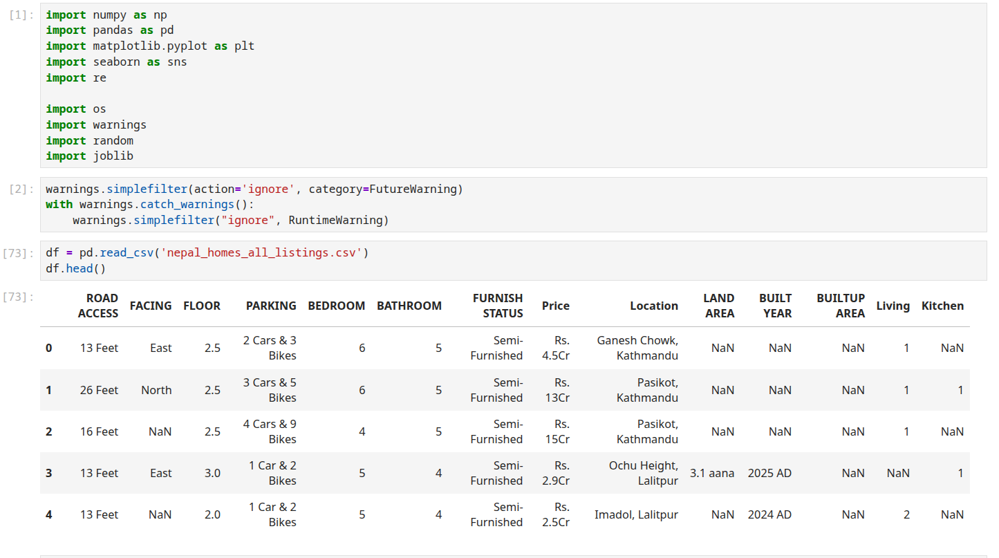
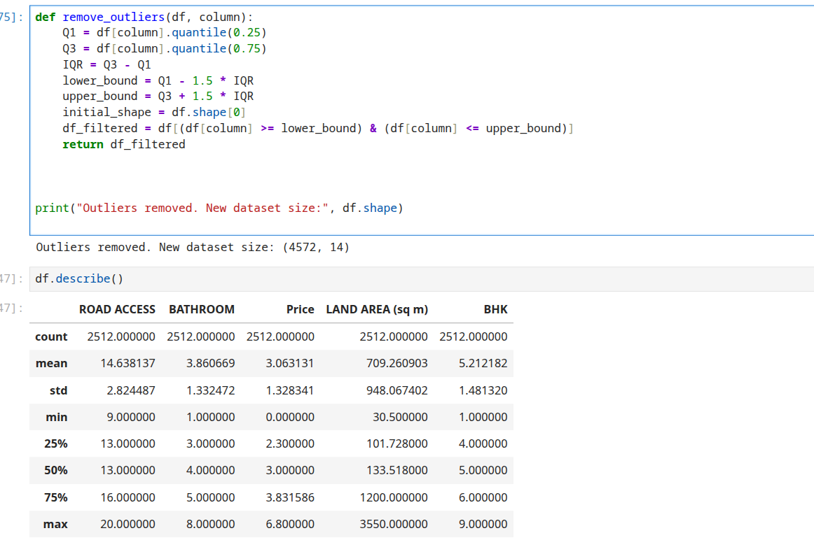
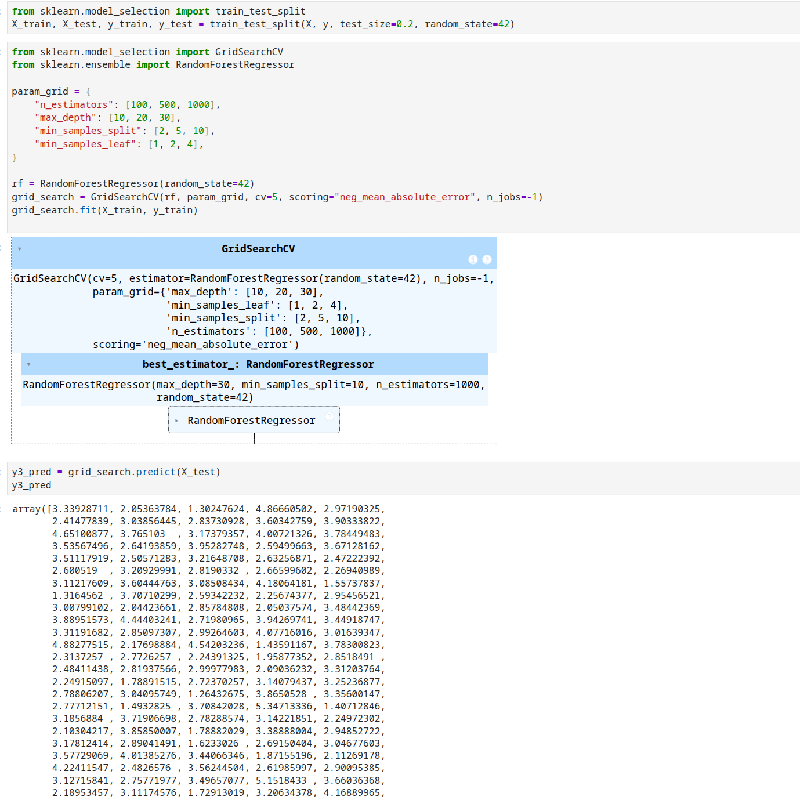
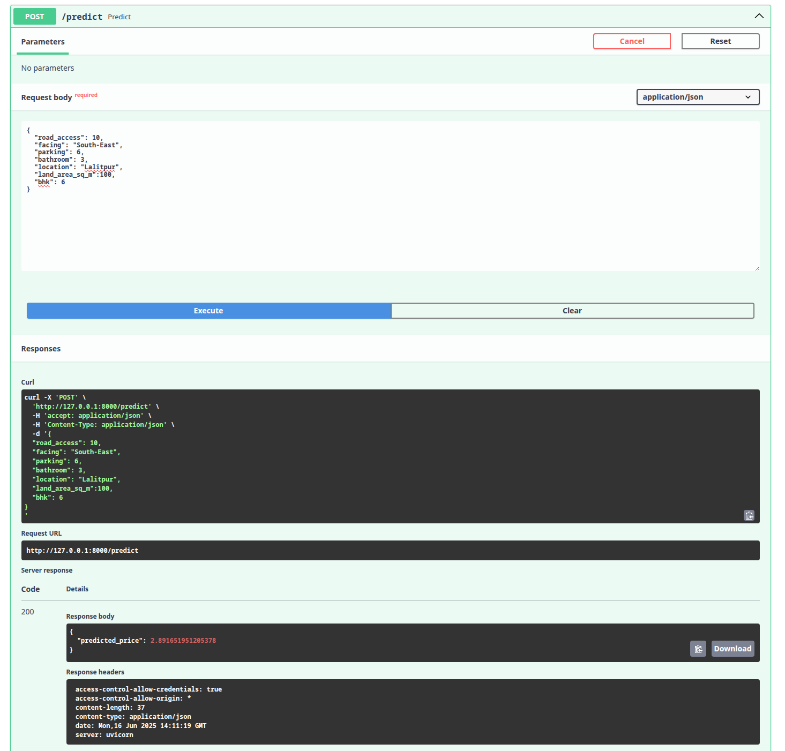
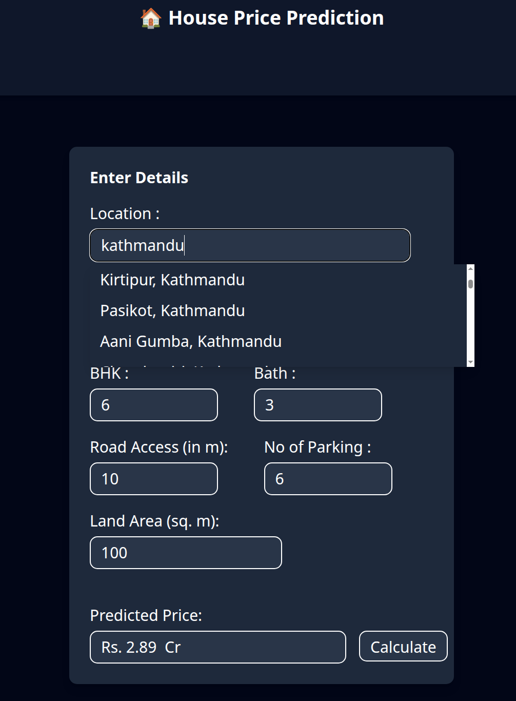
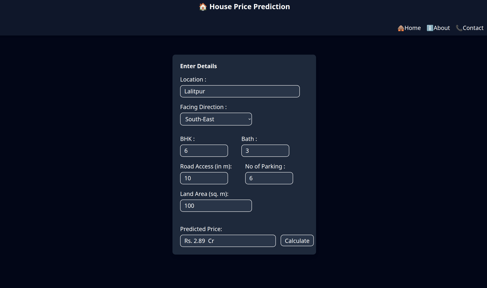

PROJECT TITLE :                                                                                                                                                          
->HOUSE PRICE PREDICTION MODEL

DESCRIPTION:                                                                                                                                                            
It is the full stack Machine Learning project that estimate  the house price on the basis of input feature like BHK, AREA< NO OF PARKING, BATHROOM etc. 
It combines a machine learning model built with Random Forest Regressor, a FastAPI backend to serve predictions, and a React frontend to provide an interactive user interface.

TOOLS AND LIBARIES:
1. Python and Libaries
2. Jupyter Notebook
3. Fast API
4. HTML CSS and JS
5. React and Tailwind
6. Git hub                                                                                                                                                                                                                           
   Libaries:                                                                                                                                     
       1. Pandas                                                                                                                                                                 
       2. Numpy                                                                                                                                                                                                    
       3. Scikit-learn                                                                                                                                                             
       4. Seaborn                                                                                                                                                                             
       5. Matplot

DATA COLLECRTION:                                                                                                                                                                                
For  this project the house price datasets was collected using webscraping technique from site using Beautifulsoup, a powerful python libary for extracting from HTML and XML files. I targeted a popular house selling website of Nepal that provide properties listing include price, area, bhk location and other attribute . After scrapimg data I saved them in CSV file.

EDA:                                                                                                                                       
Before feeding data to ml model  conducted the dat acleaning processing and visullization using python popular libaries.
   
   
  
 ML WORKFLOW                                                                                                                                                                      
                                                                                                                   
 REgressor:                                                                                                                                          
                                                                                                                                                                           

MODEL DEPLOYMENT:                                                                                                                                                                                                                           
FastAPI is used as the backend framework in this project to serve the trained machine learning model. It provides a high-performance, easy-to-use interface for communicating between the ML model and the frontend.
                                                                                                                                                                                               
FRONTEND:                                                                                                                                                                                                                                                               
The frontend of the project is built using React, providing a clean and interactive user interface that lets users input house details and get instant price predictions powered by the FastAPI backend.
                                                                                                                                                
Finallize model:                                                                                                                                                                                                   

